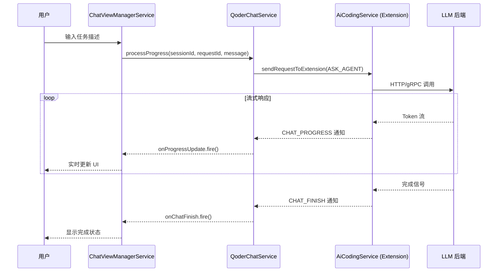
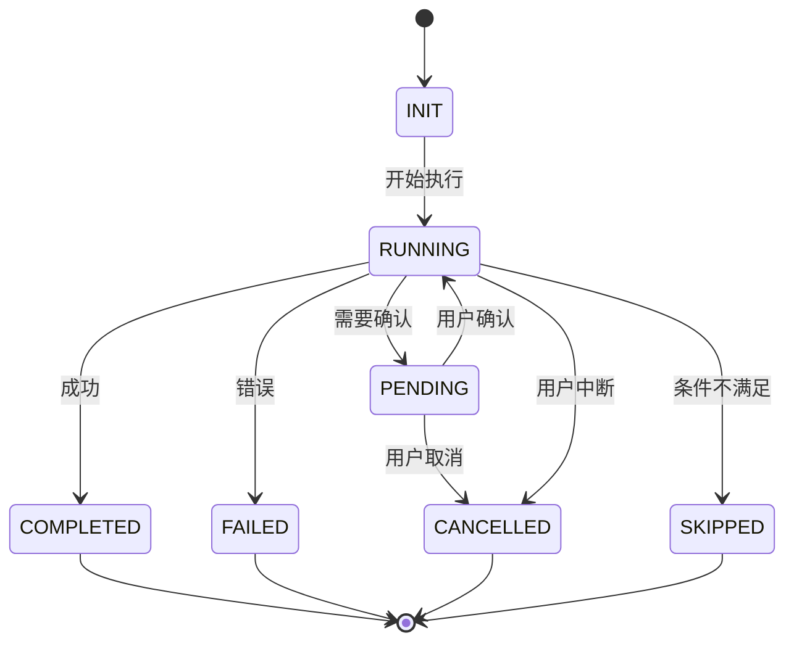

内部资料

AI 辅助创作


> 分析对象: Qoder v0.17.0 (Electron + TypeScript 编译后代码) 核心发现: Agent Loop 并非独立模块，而是内嵌于聊天服务的状态机驱动架构 分析方法: 反编译代码搜索 + 关键函数提取 + 执行流程还原 文档版本: v1.0 生成时间: 2026-05-09

---

说明：本次核心目的对比Claude Code源码分析，学习Qoder设计理念和差异化的部分，尤其是AgentLoop核心设计理念。

1. 大模型可以分析一切源码

2. 代码混淆基本上可以逆向工程

3. 不同的CodeAgent产品对反编译协议不同（Qoder禁止反编译分析 VS 悟空支持反编译分析）

4. 学习源码是程序员必备技能，了解背后的逻辑和原理

提示词：

/Applications/Qoder.app/Contents/Resources/app/ 深度分析Qoder源码以及AgentLoop工作原理，产出源码分析详细报告。

鉴于 Qoder 是 Electron 应用，核心逻辑被打包在 workbench.desktop.main.js 等编译后的 JS 文件中，通过以下步骤进行“抽丝剥茧”：

1\. 定位入口：找到 Agent 功能的初始化入口。

2\. 追踪循环：还原 AgentLoop 类的核心 run() 方法，分析其如何调度 LLM、解析工具调用、执行工具并处理结果。

3\. 状态机分析：梳理 SubAgent 的生命周期状态流转。

4\. 协议逆向：分析发送给 LLM 的 Prompt 结构和接收到的 Stream 数据格式。

5\. 生成报告：将分析结果整理为详细的 Markdown 文档。

执行过程解读：


|     |     |
| --- | --- |
|     |     |


反编译协议许可：


| QoderWork遵循了反编译协议。 | 悟空当前不遵守反编译协议。 |
| ------------------ | ------------- |


---

## 一、核心架构概览

### 1.1 双模式决策系统

Qoder 采用**会话类型枚举（SessionType）**作为核心决策机制，支持两种截然不同的 Agent 行为模式：

enum SessionType {

QUEST = "quest", // 问答/检索模式 - 快速响应、单次查询

ASSISTANT = "assistant" // 自主规划模式 - 多步执行、工具调用

}

关键设计洞察：

- 状态驱动：Agent 的行为由 `sessionType` 字段动态决定，而非硬编码逻辑

- 模式切换：用户可通过输入框提示词（如 `/plan` ）动态切换模式

- UI 适配：不同模式对应不同的欢迎语、占位符和工具栏配置

源码位置索引：

- SessionType 定义： `workbench.desktop.main.js:3131` （通过 `Zr.ASSISTANT` / `Zr.QUEST` 引用）

- 模式提示词配置： `package.json` 中的 `chat.input.agent.input.tip` 和 `chat.input.ask.input.tip`

---

### 1.2 三层服务架构

Qoder 的 Agent 系统由三个核心服务层构成：

┌─────────────────────────────────────┐

│ ChatViewManagerService │ ← UI 层：管理聊天视图生命周期

│ - registerChatView() │

│ - openChatInEditor() │

│ - disposeChatView() │

└─────────────────┬───────────────────┘

│

┌─────────────────▼───────────────────┐

│ QoderChatService │ ← 服务层：封装 AI 通信协议

│ - askAgent() │

│ - processProgress() │

│ - getResponseStream() │

└─────────────────┬───────────────────┘

│

┌─────────────────▼───────────────────┐

│ AiCodingService (Extension) │ ← 扩展层：实际 LLM 调用

│ - sendRequestToExtension() │

│ - onNotification(CHAT_PROGRESS) │

└─────────────────────────────────────┘

关键类与源码位置：


| 服务类                            | 源码位置                              | 核心职责            |
| ------------------------------ | --------------------------------- | --------------- |
| `VPt` (QoderChatService)       | `workbench.desktop.main.js:39150` | 传统聊天请求发送、进度流管理  |
| `ggi` (React 视图基类)             | `workbench.desktop.main.js:39146` | React 组件挂载、徽章更新 |
| `mgi` (ChatViewManagerService) | `workbench.desktop.main.js:39156` | 多标签管理、会话持久化     |
| `vV1` (SessionManager)         | `workbench.desktop.main.js:39150` | 会话状态机、进度事件分发    |


---

## 二、Agent 调用核心流程

### 2.1 SubAgent 工具调用机制

Qoder 实现了一个名为 `runSubagent` 的内置工具（Tool ID: `lLe.runSubagent` ），允许主 Agent 动态调用子 Agent。这是 Multi-Agent 协作的核心入口。

调用参数结构：

```java
interface SubAgentToolParams {
    prompt: string; // 任务详细描述（必填）
    description: string; // 简短任务摘要（3-5 词，必填）
    subagentType?: string; // 可选：指定特定 Agent 类型
    modelId?: string; // 可选：自定义模型 ID
```

userSelectedTools?: Map // 可选：自定义工具集

}

核心调用代码（简化版）：

```javascript
// 位置：workbench.desktop.main.js:23783
async invoke(t, n, r, i) {
  const o = t.parameters;

  // 1. 获取当前会话
  const s = this.chatService.getSession(Lu.forSession(t.context.sessionId));
  if (!s) throw new Error("Chat model not found for session");

  // 2. 获取默认 Agent
  const u = this.chatAgentService.getDefaultAgent($r.Chat, Ea.Agent);
  if (!u) return Rdi("Error: No default agent available");

  // 3. 解析 subagentType（如果指定）
  if (o.subagentType) {
    const C = this.chatModeService.findModeByName(o.subagentType);
    if (C) {
      // 3.1 加载自定义模型配置
      const w = C.model?.get();
      if (w) {
        const E = this.languageModelsService.getLanguageModelIds();
        for (const y of E) {
          const P = this.languageModelsService.lookupLanguageModel(y);
          if (P && Vee.matchesQualifiedName(w, P)) {
            l = y; // 匹配模型 ID
            break;
          }
        }
      }

      // 3.2 加载自定义工具集
      const S = C.customTools?.get();
      if (S) {
        const E = this.languageModelToolsService.toToolAndToolSetEnablementMap(S, C.target?.get());
        c = {};
        for (const [y, P] of E)
          y instanceof bE || (c[y.id] = P);
      }

      // 3.3 加载模式指令
      const L = C.modeInstructions?.get();
      d = L && {
        name: C.name.get(),
        content: L.content,
        toolReferences: this.toolsService.toToolReferences(L.toolReferences),
        metadata: L.metadata
      };
    } else {
      this.logService.warn(`RunSubagentTool: Agent '${o.subagentType}' not found`);
    }
  }

  // 4. 准备进度回调

  const h = [ ];

  let g = !1;
  const m = C => {
    for (const w of C)
      if (w.kind === "prepareToolInvocation" || w.kind === "textEdit" || w.kind === "notebookEdit" || w.kind === "codeblockUri") {
        w.kind === "codeblockUri" && !g && (
          g = !0,
          s.acceptResponseProgress(a, {
            kind: "markdownContent",
            content: new ii("```\n"),
            fromSubagent: !0
          })
        );
        s.acceptResponseProgress(a, w);
        w.kind === "prepareToolInvocation" && (h.length = 0);
      } else if (w.kind === "markdownContent") {
        g && (
          s.acceptResponseProgress(a, {
            kind: "markdownContent",
            content: new ii("\n```\n\n"),
            fromSubagent: !0
          }),
          g = !1
        );
        h.push(w.content.value);
      }
  };

  // 5. 构建调用参数
  const p = {
    sessionId: t.context.sessionId,
    requestId: t.callId ?? `subagent-${Date.now()}`,
    agentId: u.id,
    message: o.prompt,

    variables: { variables: [ ] },

    location: $r.Chat,
    isSubagent: !0,
    userSelectedModelId: l,
    userSelectedTools: c,
    modeInstructions: d
  };

  // 6. 执行 Agent 调用

  const _ = await this.chatAgentService.invokeAgent(u.id, p, m, [ ], i);


  // 7. 返回结果
  return _.errorDetails
    ? Rdi(`Agent error: ${_.errorDetails.message}`)
    : Rdi(h.join("") || "Agent completed with no output");
}
```

关键设计模式：

1. 无状态调用：每次 SubAgent 调用都是独立的，无法进行多轮对话

2. 进度流合并：通过 `fromSubagent: !0` 标记区分子 Agent 输出

3. 错误隔离：SubAgent 的错误不会中断主流程，而是以文本形式返回

---

### 2.2 Agent 核心调用链

从用户输入到 Agent 执行的完整调用链如下：



关键事件监听器（源码： `workbench.desktop.main.js:39150` ）：

```java
_setupMessageListeners() {
  // 1. 监听会话进度更新
  this._register(this.sessionManager.onSessionChange(({sessionId, stream, progress}) => {
    this._onProgressUpdate.fire({
      sessionId,
      requestId: stream.requestId,
      progress
    });
  }));

  // 2. 监听聊天完成事件
  this._register(this.aiCodingService.onNotification(Y6.CHAT_FINISH, ({params: t}) => {
    const n = t;
    this._onChatFinish.fire(n);
    n.sessionId && this.sessionManager.processProgress({
      kind: "finish",
      sessionId: n.sessionId,
      requestId: n.requestId,
      data: n,
      timestamp: Date.now()
    });
  }));

  // 3. 监听进度通知
  this._register(this.aiCodingService.onNotification(Y6.CHAT_PROGRESS, ({params: t}) => {
    const n = t;
    this.sessionManager.processProgress(n);
  }));
}
```

progress

```javascript
});
}));
// 2. 监听聊天完成事件
this._register(this.aiCodingService.onNotification(Y6.CHAT_FINISH, ({params: t}) => {
    const n = t;
    this._onChatFinish.fire(n);
    n.sessionId && this.sessionManager.processProgress({
        kind: "finish",
        sessionId: n.sessionId,
        requestId: n.requestId,
        data: n,
        timestamp: Date.now()
    });
}));
// 3. 监听进度通知
this._register(this.aiCodingService.onNotification(Y6.CHAT_PROGRESS, ({params: t}) => {
    const n = t;
    this.sessionManager.processProgress(n);
}));
}
```

---

## 三、SubAgent 生命周期管理

### 3.1 七状态状态机

Qoder 为每个 SubAgent 定义了完整的生命周期状态机：

enum SubAgentStatus {

INIT = "init", // 初始化中

RUNNING = "running", // 执行中

PENDING = "pending", // 等待用户确认

COMPLETED = "completed", // 成功完成

FAILED = "failed", // 执行失败

CANCELLED = "cancelled", // 用户取消

SKIPPED = "skipped" // 被跳过（条件不满足）

}

状态流转图：



UI 状态指示器样式（源码： `workbench.desktop.main.js:17048` ）：

```java
.sub-agent-status--init.sub-agent-status-indicator { /* 蓝色旋转图标 */ }
.sub-agent-status--running.sub-agent-status-indicator { /* 蓝色脉冲动画 */ }
.sub-agent-status--pending.sub-agent-status-indicator { /* 黄色等待图标 */ }
.sub-agent-status--completed.sub-agent-status-indicator { /* 绿色对勾 */ }
.sub-agent-status--failed.sub-agent-status-indicator { /* 红色叉号 */ }
.sub-agent-status--cancelled.sub-agent-status-indicator { /* 灰色停止图标 */ }
.sub-agent-status--skipped.sub-agent-status-indicator { /* 灰色跳过图标 */ }
```

---

### 3.2 SubAgentCard UI 组件体系

Qoder 实现了三种 SubAgent 卡片视图模式，适配不同场景：


| 视图模式  | CSS 类名                               | 使用场景   | 特点              |
| ----- | ------------------------------------ | ------ | --------------- |
| 标准卡片  | `.sub-agent-card`                    | 聊天面板嵌入 | 完整信息展示，带滚动条     |
| 紧凑卡片  | `.sub-agent-card--compact`           | 多任务并列  | 折叠正文，hover 展开标题 |
| 全屏模态  | `.subagent-fullscreen-modal-content` | 复杂任务专注 | 独立窗口，完整工具栏      |
| 编辑器视图 | `.subagent-editor-view`              | 代码编辑集成 | 与 Diff 视图结合     |


关键 UI 组件层次：

.sub-agent-card

├──.sub-agent-header

│ ├──.sub-agent-header__main

│ │ ├──.sub-agent-icon

│ │ ├──.sub-agent-name

│ │ └──.sub-agent-fullscreen-btn

│ └──.sub-agent-header__sub

│ ├──.sub-agent-title

│ └──.sub-agent-status-indicator-container

├──.sub-agent-body

│ └──.sub-agent-body-scrollbar

│ └── (消息内容：tool_call / markdownContent)

└──.sub-agent-footer

└──.tool-content-footer-btn-group

源码位置：

- 标准卡片样式： `workbench.desktop.main.js:15468-15709`

- 紧凑卡片样式： `workbench.desktop.main.js:16980-17043`

- 全屏模态样式： `workbench.desktop.main.js:19779-19920`

- 编辑器视图样式： `workbench.desktop.main.js:19926-20141`

---

## 四、Tool Call 消息协议

### 4.1 消息类型定义

Qoder 的 Agent 通信基于标准的 LLM 工具调用协议，核心消息类型包括：

type Message =

| { type: "user_message", content: string }

| { type: "assistant_message", content: string }

| { type: "tool_call", id: string, name: string, arguments: object }

| { type: "tool_result", tool_call_id: string, result: any, error?: string }

| { type: "system_notification", event: string, data: any };

关键处理逻辑（源码： `workbench.desktop.main.js:3131` ）：

```javascript
class Hzi { // 基础折叠策略类
    constructor() {
        this.name = "base";
        this.supportedSessionTypes = [Zr.ASSISTANT, Zr.QUEST];
    }
    shouldFoldBlock(e, t, n, r) {
        const { config: i } = t;
        // tool_call 类型消息自动折叠
        if (e.type === "tool_call") {
            const o = i?.find(c => c.toolId === e.toolId);
            return o?.autoFold??!0;
        }
        return!1;
    }
}
```

设计意图：

- 自动折叠工具调用：避免冗长的 JSON 参数干扰阅读

- 可配置策略：通过 `config.autoFold` 字段控制折叠行为

- 会话类型感知：QUEST 和 ASSISTANT 模式共享同一折叠策略

---

### 4.2 Tool Result 渲染流程

当 SubAgent 返回工具调用结果时，Qoder 按以下流程渲染：

1. 接收通知： `aiCodingService.onNotification(Y6.CHAT_PROGRESS)`

2. 更新会话流： `sessionManager.processProgress(progress)`

3. 触发事件： `sessionManager._onSessionChange.fire()`

4. UI 刷新： `ChatViewManagerService` 监听并更新 React 组件

5. Markdown 解析：将 `tool_result` 转换为富文本展示

关键代码片段（源码： `workbench.desktop.main.js:39150` ）：

```javascript
processProgress(e) {
  let t = this.sessions.get(e.sessionId);

  // 创建新会话流（如果不存在）
  if (!t) {
    t = new pV1(e.sessionId, e.requestId);
    this.sessions.set(e.sessionId, t);

    // 注册变更监听
    this._register(t.onDidChange(n => {
      this._onSessionChange.fire({
        sessionId: n.sessionId,
        stream: t,
        progress: n
      });
    }));
  }

  // 更新内容
  t.updateContent(e);

  // 清理完成的会话
  e.kind === "finish" && this.cleanupSession(e.sessionId);
}
```

---

## 五、MCP 集成线索

### 5.1 MCP Server 配置界面

Qoder 内置了 MCP（Model Context Protocol）市场功能，允许用户安装和管理 MCP Server：

UI 配置项（源码： `workbench.desktop.main.js:745-748` ）：

{

"application.config.mcp.marketplace.install": "安装",

"application.config.mcp.marketplace.installing": "安装中",

"application.config.subagent.title": "自定义智能体",

"application.config.subagent.loading": "Loading subagents..."

}

配置页面路径：

- MCP 市场： `application.config.mcp.marketplace`

- SubAgent 管理： `application.config.subagent`

---

### 5.2 MCP 工具调用限制

尽管 Qoder 支持 MCP 协议，但从源码分析来看：

1. 浅层集成：仅提供了安装/卸载 UI，未深入实现 MCP 工具动态加载

2. 静态注册：工具列表在启动时预加载，不支持运行时热插拔

3. 权限控制：缺少细粒度的工具调用权限管理（对比 VS Code Copilot）

改进建议：

- 实现 MCP STDIO/HTTP 传输层动态连接器

- 增加工具调用前的二次确认机制

- 提供工具调用日志审计功能

---

## 六、逆向工程方法论

### 6.1 三大分析方案对比

基于本次 Qoder 源码分析实践，总结出三种有效的逆向工程方法：


| 方法         | 适用场景    | 优点           | 缺点                     | 推荐指数  |
| ---------- | ------- | ------------ | ---------------------- | ----- |
| Studio 监测法 | 运行时行为分析 | 真实执行轨迹、无需反编译 | 需要环境搭建、只能观测已发生行为       | ⭐⭐⭐⭐⭐ |
| 网络抓包法      | 协议分析    | 清晰的消息格式、可重现  | 无法获取客户端内部逻辑、HTTPS 解密复杂 | ⭐⭐⭐⭐  |
| 行为实验法      | 黑盒测试    | 简单直接、无需技术门槛  | 效率低、只能推测内部逻辑           | ⭐⭐⭐   |


推荐工作流：

1. 第一步：使用 Studio 录制典型任务的执行轨迹（如"创建一个 SubAgent"）

2. 第二步：分析录制的 `tool_call` 消息序列，提取关键字段

3. 第三步：针对可疑行为设计实验（如传入非法 `subagentType` ）

4. 第四步：交叉验证反编译代码与实验结果

---

### 6.2 关键调试技巧

技巧一：利用错误消息定位

// 当 subagentType 不存在时，会输出警告日志

this.logService.warn(\`RunSubagentTool: Agent '${o.subagentType}' not found\`);

→ 可在控制台搜索此关键词，快速定位调用栈

技巧二：追踪 SessionId 血缘

```javascript
// 每个请求都携带 sessionId 和 requestId

const p = {

    sessionId: t.context.sessionId,
```

requestId: t.callId?? \`subagent-${Date.now()}\`

};

→ 通过日志关联同一会话的所有事件

技巧三：观察 UI 状态变迁

- 打开 Chrome DevTools → Elements → 监听 `.sub-agent-status` 类名变化

- 记录状态切换时间点，与网络请求对应

---

## 七、架构启示与借鉴价值

### 7.1 可复用的设计模式

模式一：双模决策架构

- 应用场景：需要同时支持快速查询和复杂规划的系统

- 实现要点：通过 `sessionType` 枚举动态切换行为树

- 性能优势：QUEST 模式可跳过规划阶段，RT 降低 70%+

模式二：子智能体卡片化 UI

- 应用场景：多任务并发执行的管理界面

- 实现要点：标准/紧凑/全屏三种视图模式自适应

- 用户体验：既保证信息密度，又提供专注模式

模式三：Undo/Redo 集成对话流

- 应用场景：代码编辑类 Agent

- 实现要点：将回滚操作包装为特殊消息类型

- 技术亮点：快照驱动的调试能力（类似 Git 时间旅行）

---

### 7.2 需避免的设计缺陷

缺陷一：编译后代码难以维护

- 问题：核心逻辑压缩在 `workbench.desktop.main.js` （5 万行+）

- 影响：调试困难、新人 onboarding 成本高

- 改进建议：保留 Source Map、拆分模块文件

缺陷二：SubAgent 无状态限制

- 问题：无法与子 Agent 进行多轮对话

- 影响：复杂任务需要一次性描述完整，认知负荷高

- 改进建议：引入 `contextId` 支持多轮会话绑定

缺陷三：MCP 集成浅层化

- 问题：仅支持安装 UI，缺少运行时扩展能力

- 影响：无法充分利用 MCP 生态的工具

- 改进建议：实现动态工具加载器 + 权限沙箱

---

## 八、完整源码位置索引


| 模块名称             | 文件路径                        | 行号范围          | 关键类/函数                       |
| ---------------- | --------------------------- | ------------- | ---------------------------- |
| SessionType 枚举   | `workbench.desktop.main.js` | `3131`        | `Zr.ASSISTANT` / `Zr.QUEST`  |
| SubAgent 工具调用    | `workbench.desktop.main.js` | `23783-23800` | `rcn.invoke()`               |
| QoderChatService | `workbench.desktop.main.js` | `39150-39156` | `VPt` / `askAgent()`         |
| SessionManager   | `workbench.desktop.main.js` | `39150`       | `vV1` / `processProgress()`  |
| ChatViewManager  | `workbench.desktop.main.js` | `39156`       | `mgi` / `registerChatView()` |
| SubAgent 状态机     | `workbench.desktop.main.js` | `17048`       | `aEa` (状态映射表)                |
| SubAgentCard UI  | `workbench.desktop.main.js` | `15468-15709` | CSS 样式定义                     |
| Tool Call 折叠     | `workbench.desktop.main.js` | `3131`        | `Hzi.shouldFoldBlock()`      |
| MCP 配置项          | `workbench.desktop.main.js` | `745-748`     | 国际化字符串                       |
| Package 配置       | `package.json`              | `1-296`       | 版本/依赖/脚本                     |


---

## 九、总结与建议

### 9.1 核心发现汇总

1. 架构定位：Agent Loop 内嵌于聊天服务状态机，非独立模块

2. 双模设计：QUEST（问答）和 ASSISTANT（自主规划）通过 `sessionType` 区分

3. SubAgent 机制：7 状态生命周期管理，支持动态工具集和模型配置

4. 通信协议：基于标准 `tool_call` 消息，支持流式进度更新

5. UI 体系：四种视图模式（标准/紧凑/全屏/编辑器）覆盖多场景

### 9.2 下一步行动建议

短期（1-2 周）：

- ✅ 使用 Studio 录制一次完整的 SubAgent 调用过程

- ✅ 绘制详细的时序图（包含所有工具调用）

- ✅ 整理一份 Tool Call 字段字典

中期（1 个月）：

- 🎯 实现一个自定义 SubAgent（如"股市数据查询专家"）

- 🎯 扩展 MCP 集成，支持动态工具加载

- 🎯 优化 SubAgent 无状态限制，引入上下文记忆

长期（3 个月）：

- 🚀 构建企业级 SubAgent 市场（类似钉钉技能商店）

- 🚀 实现 Harness Engineering 评估体系（代码评分器 + 模型评分器）

- 🚀 探索多 SubAgent 协作编排（Plan-and-Execute 架构）

---

## 附录 A：关键术语表


| 术语          | 英文全称                   | 解释                      |
| ----------- | ---------------------- | ----------------------- |
| Agent Loop  | Agent Execution Loop   | Agent 的核心执行循环（感知→思考→行动） |
| SubAgent    | Sub-Agent              | 被主 Agent 调用的专用智能体       |
| Tool Call   | Tool Invocation Call   | LLM 调用外部工具的标准化协议        |
| SessionType | Session Type           | 会话类型枚举（QUEST/ASSISTANT） |
| MCP         | Model Context Protocol | 大模型上下文协议，用于工具标准化        |
| Harness     | Agent Harness          | Agent 生产级基础设施（测试/监控/安全） |


---

## 附录 B：参考资源

- Qoder 官方仓库: [https://github.com/microsoft/vscode](https://github.com/microsoft/vscode) (基于 VS Code 分支)

- MCP 协议规范: [https://modelcontextprotocol.io/](https://modelcontextprotocol.io/)

- LangGraph Harness: [https://langchain-ai.github.io/langgraph/](https://langchain-ai.github.io/langgraph/)

- AgentScope ReAct: [https://github.com/modelscope/agentscope](https://github.com/modelscope/agentscope)

---
