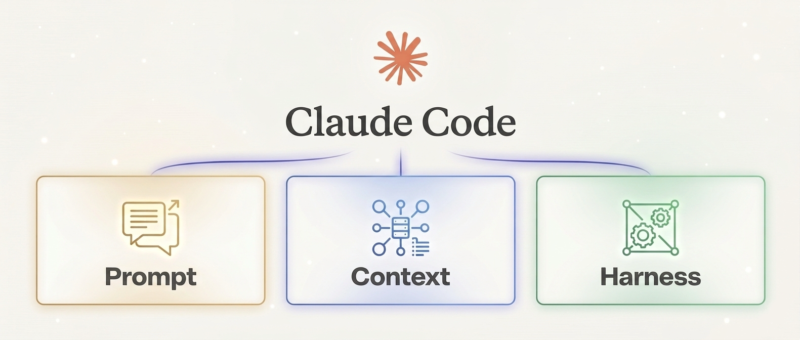
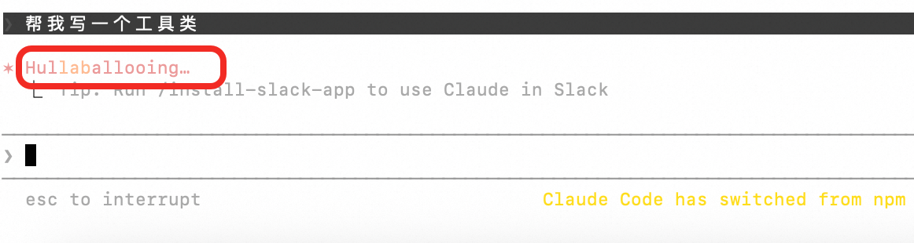
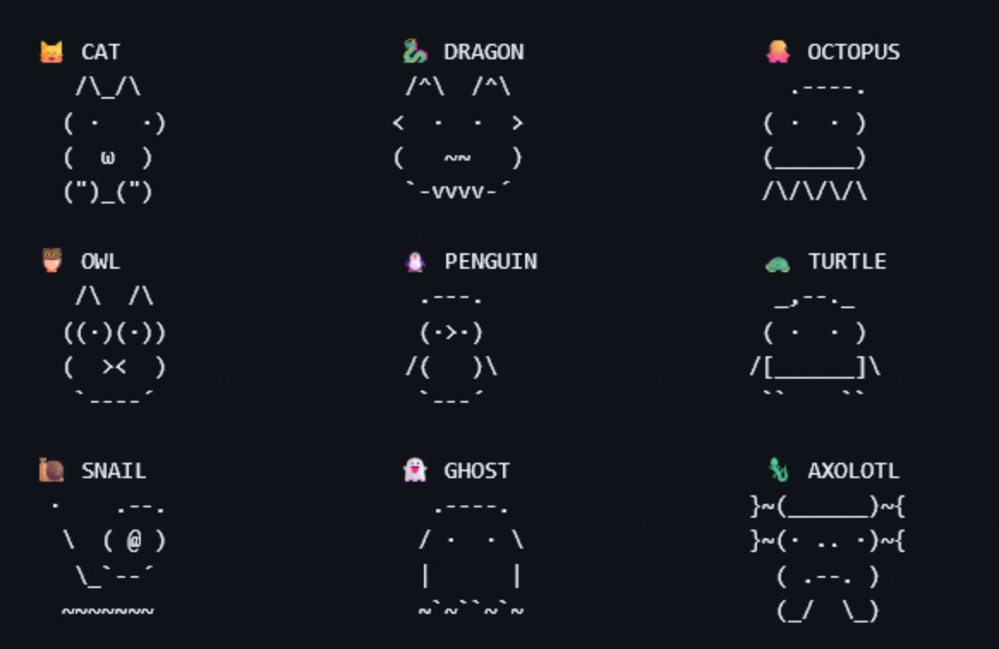

# 深度解析 Claude Code 在 Prompt / Context / Harness 的设计与实践

**作者：** 姜剑(飞樰)  
**发表时间：** 2026年4月3日  
**浏览次数：** 1.5k次  
**原文链接：** https://ata.atatech.org/articles/11020605711

---



## 背景

本文将深入分析 Claude Code 的设计与实践，对比 OpenClaw 的实现方式，重点探讨 Prompt Engineering、Context Engineering 和 Harness Engineering 三个核心维度。

## Prompt Engineering：静态与动态信息的组装

### System Prompt的动态组装过程

Claude Code 的 System Prompt 通过 6 个步骤动态组装：

1. **基础系统提示** - 核心指令和约束
2. **工具定义** - 可用工具的 JSON Schema 定义
3. **上下文注入** - 动态获取的项目信息
4. **记忆整合** - 历史会话和记忆内容
5. **用户偏好** - 个性化设置和习惯
6. **实时状态** - 当前会话状态信息

### System Prompt完整组装结果

System Prompt 包含三类信息：
- **静态信息**：核心指令、工具定义、固定规则
- **动态信息**：上下文、记忆、用户偏好
- **上下文注入**：实时状态、当前任务信息

### 给子Agent分配任务的Prompt

当需要创建子 Agent 时，Claude Code 会动态生成任务特定的 Prompt：

```
你是一个专业的 [角色]，任务是 [任务描述]。
上下文信息：[相关上下文]
输出要求：[格式和约束]
```

## Context Engineering：引导、压缩和记忆

### CLAUDE.md 项目说明

CLAUDE.md 是 Claude Code 的核心上下文文件，位于项目根目录，包含：
- 项目概述和架构说明
- 编码规范和最佳实践
- 常用命令和工作流
- 重要文件和目录说明

### 三层渐进式压缩体系

Claude Code 实现了智能的上下文压缩机制：

1. **Micro Compact** - 微观压缩：单个消息级别的精简
2. **Session Memory Compact** - 会话记忆压缩：保留关键信息，丢弃冗余
3. **Full LLM Compact** - 全量压缩：整个上下文的智能摘要

### Memdir 结构化记忆系统

Memdir 是 Claude Code 的记忆存储系统：
- 结构化存储历史会话
- 支持记忆检索和关联
- 持久化到本地文件系统



## Harness Engineering：环境、约束与控制

### 系统级强提醒引导

Claude Code 通过系统级提示进行行为引导：
- 安全约束提醒
- 最佳实践提示
- 错误预防机制

### 六大系统内置AgentTool

Claude Code 内置了六种专业 Agent：

1. **General-Purpose** - 通用任务处理
2. **Explore** - 代码探索和导航
3. **Plan** - 任务规划和分解
4. **Verification** - 结果验证和检查
5. **Guide** - 用户引导和帮助
6. **Statusline** - 状态显示和更新
7. **Fork** - 并行任务执行

### 精细化的安全体系

**Permission Engine** - 权限引擎：
- 文件操作权限控制
- 命令执行白名单
- 网络访问限制

**Sandbox Isolation** - 沙箱隔离：
- 进程级隔离
- 资源使用限制
- 安全边界保护

### 异步生成器驱动的主循环

Claude Code 采用异步生成器架构：
- 支持流式输出
- 非阻塞 I/O 操作
- 高效的并发处理

### 可编程的钩子拦截机制

提供丰富的钩子点：
- 前置钩子：命令执行前拦截
- 后置钩子：结果处理后拦截
- 错误钩子：异常处理拦截



## 有趣的彩蛋

### Caffeinate防止休眠

Claude Code 会自动调用系统的 caffeinate 命令防止电脑休眠，确保长时间任务不被中断。

### Anti-Distillation反蒸馏

内置反蒸馏机制，防止模型输出被用于训练其他模型。

### Undercover Mode卧底模式

特殊模式用于敏感操作，减少系统痕迹。

### Dogfooding内部吃狗粮模式

Anthropic 内部使用 Claude Code 开发 Claude Code，持续迭代优化。

### 用户情绪辱骂处理

智能识别用户情绪，对辱骂性语言进行妥善处理。

### 荒诞的加载动词

使用有趣的加载提示词，如 "正在思考..."、"正在分析..."、"正在创造..."

### Buddy System电子宠物

类似电子宠物的陪伴系统，增强用户体验。

## 总结

Claude Code 在 Prompt、Context、Harness 三个维度都展现了卓越的设计：

1. **Prompt Engineering**：动态组装 + 分层管理，实现灵活的指令系统
2. **Context Engineering**：三层压缩 + 结构化记忆，高效管理长上下文
3. **Harness Engineering**：安全沙箱 + 多 Agent 协作，提供可靠的执行环境

这些设计思想对于构建企业级 AI 编程助手具有重要的参考价值。

---

**标签：** AI, Claude, Prompt Engineering, Context Engineering, AI编程助手

**分类：** 人工智能 / 大模型应用
