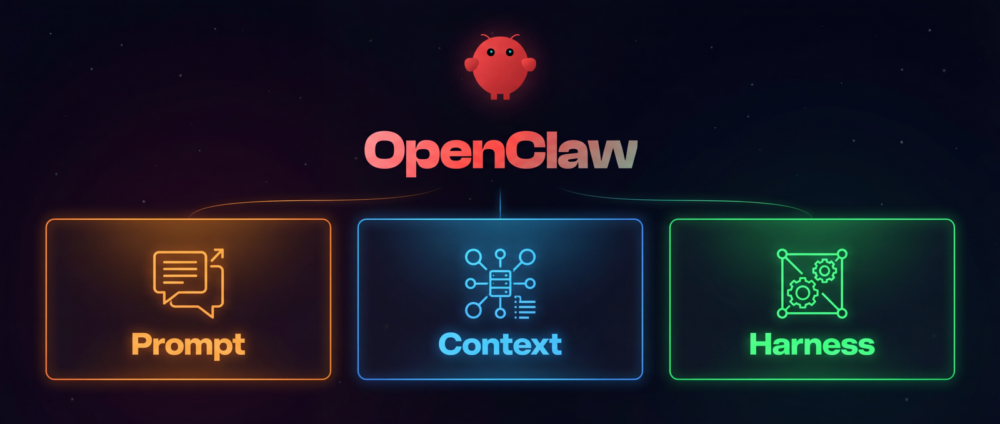

# 重生之我是AI Agent工程师1：用Java从0到1实现Harness

**作者：** 辛一品(弦鸣)  
**发表时间：** 2026年3月25日（3月30日更新）  
**浏览次数：** 1.9k次

---

想象一下，大模型是一个横冲直撞的野马，拥有使不完的劲，但总是乱跑，没有方向

我们想要驾驭这匹野马，就需要马鞍和缰绳，坐稳，拉缰，指哪走哪


Harness就是这个马鞍和缰绳，他负责管理和控制大模型（LLM）的运行流程，让大模型文本生成能力转化为可落地的工程能力

本文，我们将使用Java从0到1搭建一个Harness。

---

## 1、First LLM API Call：初识大模型

> Before building an agent, learn the wire format. -- 造房子前，先打地基

### 1.1 问题

作为后端工程师，我们经常与各种API打交道，调用大模型本质就是一次HTTP请求

然而，我们往往习惯于通过SDK接入——这种方式固然方便，但后续遇到问题时，面对的是一个黑盒之上再套黑盒的无敌黑盒，完全没有头绪。

所以第一章，我们需要学习以下内容：
- 通过Anthropic Java SDK 调用大模型 ，了解/v1/messages接口的最小请求与最小响应数据的格式
- 通过Java 原生的Http Client调用大模型，构建请求，解析响应，深入了解数据结构
- 深入理解SSE协议返回格式，手动实现打字机效果的输出

### 1.2 第一次大模型调用

maven依赖：

```xml
<dependency>
  <groupId>com.anthropic</groupId>
  <artifactId>anthropic-java</artifactId>
  <version>2.18.0</version>
</dependency>
//额外依赖，后续章节用于json序列化
<dependency>
  <groupId>com.fasterxml.jackson.core</groupId>
  <artifactId>jackson-databind</artifactId>
  <version>2.18.3</version>
</dependency>
```

之前养虾有开通阿里云的coding plan，这里就用阿里云的base_url

代码实现：

```java
/**
 * @author 弦鸣
 * @desc 最简调用
 * @date 2026/3/23 18:39
 */
public class simple_main {
    private static final String SYSTEM_PROMPT = "You are a joker.Tell a joke about whatever topic the user inputs.";

    public static void main(String[] args) {
        AnthropicClient sdkClient = AnthropicOkHttpClient.builder()
            // 百炼平台获取base_url
            .baseUrl("https://coding.dashscope.aliyuncs.com/apps/anthropic")
            // 环境变量获取API-KEY
            .apiKey(System.getenv("DASHSCOPE_API_KEY"))
            .build();

        // 读取用户输入
        Scanner scanner = new Scanner(System.in);
        System.out.print("Joke Topic: ");
        String topic = scanner.nextLine();

        System.out.println("=== SDK ===");
        MessageCreateParams params = MessageCreateParams.builder()
            .model("kimi-k2.5")
            .maxTokens(5000)
            .system(SYSTEM_PROMPT)
            .addUserMessage("topic:"+topic)
            .build();

        Message message = sdkClient.messages().create(params);
        
        // 只输出文本内容
        for (ContentBlock block : message.content()) {
            if (block.isText()) {
                System.out.println(block.asText().text());
            }
        }
    }
}
```

运行结果：


### 1.3 最小请求参数与最小响应结构

最小请求参数只需四个字段：model、max_tokens、system、messages

```json
{
  "model": "kimi-k2.5",
  "max_tokens": 5000,
  "system": "You are a concise assistant. Explain the topic with one practical example.",
  "messages": [
    {
      "role": "user",
      "content": "Explain SSE to a Java beginner in three short bullet points and one example."
    }
  ]
}
```

如果你想开启流式输出，只需要再新增一个字段：

```json
{
  "stream": true
}
```

对于最小响应，我们只需要先关注这几个字段:

```json
{
  "id": "msg_d42ce5b4-7824-4555-8a87-5666df318472",
  "role": "assistant",
  "content": [
    {
      "type": "thinking",
      "thinking": "..."
    },
    {
      "type": "text",
      "text": "..."
    }
  ],
  "stop_reason": "end_turn"
}
```

这就是"协议本质": 无论你外面包了多少框架, 本质上都还是一段 JSON 请求, 再加一段 JSON 或 SSE 响应。

### 1.4 OpenAI 协议 vs Anthropic 协议

既然是http请求，那肯定有一份约定好的协议，下面先讲一下最常用的两种大模型协议

#### 1.4.1 OpenAI 协议

openAI的协议目前算是行业标准协议，所有厂商都兼容

| 维度 | 特点 |
|------|------|
| 端点 | /v1/chat/completions |
| 请求格式 | POST /v1/chat/completions<br>{<br>  "model": "gpt-4",<br>  "messages": [{"role": "user", "content": "你好"}],<br>  "stream": true<br>} |
| 消息角色 | system / user / assistant / tool |
| 认证方式 | Authorization: Bearer {api_key} |
| 响应格式 | {<br>  "model": "gpt-4",<br>  "choices": [{<br>    "index": 0,<br>    "message": {<br>      "role": "assistant",<br>      "content": "你好！很高兴见到你。有什么我可以帮助你的吗？"<br>    },<br>    "finish_reason": "stop"<br>  }]<br>} |
| 消息结构 | messages: [{"role": "user", "content": "..."}] |

#### 1.4.2 Anthropic 协议（Claude 独有）

Anthropic 坚持独立协议，不兼容 OpenAI 格式。不过anthropic拥有最好用的编程工具和最强大的大模型，很多厂商也选择兼容它，比如阿里云就兼容了Anthropic 协议，本文选择使用Anthropic协议进行开发

| 维度 | Anthropic 特点 |
|------|----------------|
| 端点 | /v1/messages（注意不是 chat/completions） |
| 请求格式 | POST /v1/messages<br>{<br>  "model": "claude-3-opus-20240229",<br>  "max_tokens": 1024,<br>  "system": "你是一个助手",<br>  "messages": [{"role": "user", "content": "你好"}]<br>} |
| 认证方式 | x-api-key: {api_key} + anthropic-version: 2023-06-01 |
| 消息角色 | user / assistant |
| 响应格式 | {<br>  "role": "assistant",<br>  "model": "claude-3-5-sonnet-20241022",<br>  "content": [{<br>    "type": "text",<br>    "text": "你好！很高兴见到你。有什么我可以帮助你的吗？"<br>  }],<br>  "stop_reason": "end_turn"<br>} |

#### 1.4.3 请求转发：为什么改 base_url 就能调到阿里云/Idealab？

阿里云（以及百度、智谱、DeepSeek 等）在网关层做了协议适配：

```
你的请求 (OpenAI 格式)
    ↓
阿里云网关 ——[翻译]→ 内部模型原生格式
    ↓
通义千问/DeepSeek 模型
    ↓
阿里云网关 ——[翻译]→ OpenAI 格式响应
    ↓
你收到的响应 (与 OpenAI 结构一致)
```

### 1.5 RAW HTTP请求

我们使用java.net.http的中的类，发起一次http请求调用，并打印response.body

```java
/**
 * @author 弦鸣
 * @desc http请求
 */
public class http_main {
    private static final String SYSTEM_PROMPT = "You are a joker.Tell a joke about whatever topic the user inputs.";
    private static final ObjectMapper MAPPER = new ObjectMapper();

    public static void main(String[] args) {
        // 读取用户输入
        Scanner scanner = new Scanner(System.in);
        System.out.print("Joke Topic: ");
        String topic = scanner.nextLine();

        // 创建HTTP客户端
        HttpClient httpClient = HttpClient.newBuilder()
            .connectTimeout(Duration.ofSeconds(30))
            .build();

        System.out.println("=== Raw HTTP ===");
        try {
            // 构建请求体
            String requestBody = buildRequestBody(topic, false).toPrettyString();
            // 创建http请求
            HttpRequest request = baseRequest(System.getenv("DASHSCOPE_API_KEY"))
                .header("Accept", "application/json")
                .POST(HttpRequest.BodyPublishers.ofString(requestBody))
                .build();

            HttpResponse<String> response = httpClient.send(request, HttpResponse.BodyHandlers.ofString(StandardCharsets.UTF_8));
            System.out.println(response.body());
        } catch (Exception e) {
            throw new RuntimeException("Raw HTTP request failed", e);
        }
    }
}
```

返回结果：

```json
{
    "role": "assistant",
    "usage": {
        "output_tokens": 30,
        "cache_creation_input_tokens": 0,
        "input_tokens": 32,
        "cache_read_input_tokens": 0
    },
    "stop_reason": "end_turn",
    "model": "kimi-k2.5",
    "id": "msg_11f3a456-9575-43da-ba2a-bc79fbb83aca",
    "type": "message",
    "content": [
        {
            "signature": "",
            "type": "thinking",
            "thinking": ""
        },
        {
            "text": "Here's a joke about apples:\n\nWhy did the apple stop rolling down the hill?\n\nBecause it ran out of **juice**! 🍎",
            "type": "text"
        }
    ]
}
```

### 1.6 SSE协议

SSE 全称是 Server-Sent Events。它不是一次性返回完整 JSON, 而是把响应拆成很多小事件:

```
event: content_block_delta
data: {"type":"content_block_delta","delta":{"type":"text_delta","text":"Hel"}}


event: content_block_delta
data: {"type":"content_block_delta","delta":{"type":"text_delta","text":"lo"}}
```

客户端要做的事情非常简单:
1. 按行读取响应流。
2. 识别 event: 和 data:。
3. 遇到空行, 说明一个事件结束。
4. 把 data: 后面的 JSON 解析出来。
5. 如果是文本增量, 立即打印。

我们在http调用的基础上，使用sse协议，实现流式输出效果，print + flush 就是"打字机效果"的关键：

```java
if ("content_block_delta".equals(type)) {
    JsonNode delta = json.path("delta");
    if ("text_delta".equals(delta.path("type").asText())) {
        System.out.print(delta.path("text").asText());
        System.out.flush();
    }
}
```

---

## 2、Agent In Loop：最小智能体循环

> "One loop & Bash is all you need" -- 一个工具 + 一个循环 = 一个智能体。

### 2.1 问题

在第一章，我们实现了与大模型"一问一答"式的对话。但这里有个根本瓶颈：大模型是个"大脑"，只有思考能力，没有"手脚"——它只能生成文本，无法触碰现实世界。

如果你想让它:
- 看目录
- 读文件
- 执行脚本
- 检查结果

那就必须给它安装一双"手" —— 让模型能够调用外部工具，把思考转化为行动。

### 2.2 解决方案

本章，我们需要构建一个最简单的智能体循环：模型思考->调用工具->再思考



```
+--------+      +-------+      +---------+
|  User  | ---> |  LLM  | ---> |  Tool   |
| prompt |      |       |      | execute |
+--------+      +---+---+      +----+----+
                    ^                |
                    |   tool_result  |
                    +----------------+
                    (loop until stop_reason != "tool_use")
```

### 2.3 核心实现

**第一步：准备一个上下文数组**

```java
List<MessageParam> history = new ArrayList<>();
```

**第 2 步：用户query写入**

调用模型前，先将用户消息写入history

```java
history.add(userTextMessage(query));
```

**第3步：声明可用工具**

告诉模型：你可以用 bash 工具执行命令

```json
{
  "name": "bash",
  "description": "Run a shell command.",
  "input_schema": {
    "type": "object",
    "properties": {
      "command": { "type": "string" }
    },
    "required": ["command"]
  }
}
```

**第4步：调用模型**

将history作为入参messages，获取模型响应结果

```java
// 构造一次完整的模型请求
return MessageCreateParams.builder()
    .model(MODEL)
    .system(SYSTEM_PROMPT)
    .maxTokens(8000)
    .messages(history)
    .addTool(bashTool())
    .build();
```

并将模型response添加到history中

```java
history.add(response.toParam());
```

**第5步：判断循环是否结束**

```java
// 核心判断：模型是"想继续用工具"还是"给最终答案"？
if (response.stopReason().orElse(null) != StopReason.TOOL_USE) {
    return extractText(response.content());  // 结束了，返回答案
}
// 否则继续循环...
```

**第6步：执行模型想要的工具**

```java
// 遍历返回结果的 block
List<ContentBlockParam> results = new ArrayList<>();
for (ContentBlock block : response.content()) {
  if (!block.isToolUse()) {
    continue;
  }
  Map<?, ?> input = block.asToolUse()._input().convert(Map.class);
  // 模型说"用 bash"，我们就取出命令并执行
  String command = String.valueOf(input.get("command"));
  System.out.println("$ " + command);
  // 执行runBash
  String output = runBash(command);
  System.out.println(output+"\n");
  // 工具结果聚合到results
  results.add(ContentBlockParam.ofToolResult(ToolResultBlockParam.builder()
                                             .toolUseId(block.asToolUse().id())
                                             .content(output)
                                             .build()));
}
```

**第7步：工具结果回填上下文history，继续循环**

```java
// 工具结果加入history，模型会在下一轮看到执行结果
history.add(userToolResultMessage(results));
```

总体流程如下：

```
开始
  │
  ▼
┌─────────────────┐
│ 用户提问 → 加入 history │
└────────┬────────┘
         │
         ▼
┌─────────────────┐     是      ┌─────────────┐
│ 调用 LLM（带上工具列表） │────────▶│ 模型要调用工具？ │
└────────┬────────┘            └──────┬──────┘
         │ 否                          │
         ▼                             ▼
┌─────────────────┐           ┌─────────────┐
│ 返回最终答案，结束      │           │ 执行对应工具命令  │
└─────────────────┘           └──────┬──────┘
                                     │
                                     ▼
                            ┌─────────────┐
                            │ 结果包装为 tool_result │
                            │ 加入 history │
                            └──────┬──────┘
                                   │
                                   └──────────────┐
                                                  │
                                    ◄─────────────┘
                                  （回到"调用 LLM"）
```

### 2.4 完整代码

试试这些prompt：
1. List all Java files in this project
2. Show me the current working directory
3. Create a file named hello.txt with the text hello agent
4. Read hello.txt by using bash

---

## 3、Tool Handler：工具调度器

> Add a tool by adding a handler.  --加工具，不改循环

### 3.1 问题

在 第二章，模型只有一个 bash 工具。它当然能干活，但问题也很明显：
1. 每加一个工具，都要在主循环的agentLoop中适配
2. 所有操作都经由 bash，安全面太大。

### 3.2 解决方案

在本章，我们会实现 Tool Dispatch（工具调度器），实现统一工具注册，让模型请求自动分发到对应的 Tool注册的函数上

```
+--------+      +-------+      +------------------+
|  User  | ---> |  LLM  | ---> | Tool Dispatch    |
| prompt |      |       |      | bash -> runBash  |
+--------+      +---+---+      | read -> runRead  |
                    ^           | write -> runWrite|
                    |           | edit -> runEdit  |
                    +-----------+------------------+
                    tool_result
```

### 3.3 核心实现

**1、新增三个工具schema的定义，目前一共有四个工具**

| 工具名 | schema |
|--------|--------|
| bash | {"name":"bash","description":"Run a shell command.","input_schema":{"type":"object","properties":{"command":{"type":"string"}},"required":["command"]}} |
| read_file | {"name": "read_file","description": "Read a file from the workspace.","input_schema": {"type": "object","properties": {"path": {"type": "string"},"limit": {"type": "integer"}},"required": ["path"]}} |
| write_file | {"name": "write_file","description": "Write content to a file in the workspace.","input_schema": {"type": "object","properties": {"path": {"type": "string"},"content": {"type": "string"}},"required": ["path", "content"]}} |
| edit_file | {"name": "edit_file","description": "Replace text in a file in the workspace.","input_schema": {"type": "object","properties": {"path": {"type": "string"},"old_text": {"type": "string"},"new_text": {"type": "string"}},"required": ["path", "old_text", "new_text"]}} |

**2、定义TOOL_HANDLERS，将工具注册进去**

```java
private static final Map<String, ToolHandler> TOOL_HANDLERS = new LinkedHashMap<>();
// 注册
TOOL_HANDLERS.put("bash", input -> runBash(asString(input, "command")));
TOOL_HANDLERS.put("read_file", input -> runRead(asString(input, "path"), asInt(input, "limit")));
TOOL_HANDLERS.put("write_file", input -> runWrite(asString(input, "path"), asString(input, "content")));
TOOL_HANDLERS.put("edit_file", input -> runEdit(...));
```

这样加工具时，只需要：
- 注册一个 schema
- 注册一个 handler

**3、用路径沙箱保护工作区**

read_file、write_file、edit_file 都不直接相信模型传来的路径，而是先经过 safePath函数的验证：

```java
// 当前的工作目录
private static final Path WORKDIR = Paths.get("").toAbsolutePath().normalize();

// 校验是否在工作目录
Path path = WORKDIR.resolve(pathText).normalize();
if (!path.startsWith(WORKDIR)) {
    throw new IllegalArgumentException("Path escapes workspace: " + pathText);
}
```

这一步可以防止模型访问工作区之外的文件。

**4、循环里只负责查表和执行**

```java
// `agentLoop(...)` 的结构仍然很简单：
String name = block.asToolUse().name();
Map<?, ?> input = block.asToolUse()._input().convert(Map.class);
ToolHandler handler = TOOL_HANDLERS.get(name);
String output = handler == null ? "Error: Unknown tool: " + name : handler.run(input);
```

### 3.4 完整代码

试试这些prompt：
1. Create a file called hello.txt with the text hello tool use
2. Edit hello.txt to change tool use to java agent
3. Read hello.txt to verify the edit

### 3.5 本章总结

agent loop 是稳定骨架，工具系统是可扩展插件层
后面再加更多工具，本质上都只是继续往 dispatch map 里注册 handler。

相对上一章的变化：

| 组件 | 第二章 | 第三章 |
|------|--------|--------|
| Tools | 1 个 bash | 4 个工具 |
| Dispatch | 硬编码执行 bash | TOOL_HANDLERS 分发 |
| Path safety | 无 | safePath() |
| Agent loop | 有 | 不变 |

---

## 4、Todo Write ：让计划不被遗忘

> An agent without a plan drifts. --没有计划的agent将随波逐流

### 4.1 问题

多步任务最容易出现的问题不是不会做，而是做着做着就偏了：
1. 重复已经做过的步骤
2. 跳过中间步骤
3. 对话变长后忘记原计划

只靠 prompt 提醒往往不够，因为工具结果会不断把上下文冲掉。

### 4.2 解决方案

在本章，我们需要新增一个 todo 工具，并在内存中维护一份带状态的待办列表：

```
+--------+      +-------+      +---------+
|  User  | ---> |  LLM  | ---> | Tools   |
| prompt |      |       |      | + todo  |
+--------+      +---+---+      +----+----+
                    ^                |
                    |   tool_result  |
                    +----------------+
                          |
              +-----------+-----------+
              | TodoManager state     |
              | [ ] task A            |
              | [>] task B            |
              | [x] task C            |
              +-----------------------+
```

### 4.3 核心实现

**1、新增TodoManager 保存带状态的任务**

TodoManager 做了三件事：
- update：作为工具让模型自主更新任务和进度
- render：模型调用完update，渲染markdown格式的代办列表，作为工具结果回写模型
- 强制同一时间只能有一个 in_progress

```java
if (inProgressCount > 1) {
    throw new IllegalArgumentException("Only one task can be in_progress at a time");
}
```

这会逼模型聚焦当前步骤，而不是同时铺开一堆事情。

**2、todo 也是普通工具**

和 bash、read_file 一样，todo 也只是 TOOL_HANDLERS里的一个 handler：

```java
TOOL_HANDLERS.put("todo", input -> TODO.update(asItems(input.get("items"))));
```

这说明 todo 并不是特殊机制，它本质上还是一个工具。

**3、三轮对话不更新 todo，强制插入提醒信息**

agentLoop(...) 里维护了一个计数器：

```java
roundsSinceTodo = usedTodo ? 0 : roundsSinceTodo + 1;
```

如果连续 3 轮没有调用 todo，就往本轮工具结果前面插入一条提醒：

```java
// 连续三轮没有使用todo工具，则触发提醒
if (roundsSinceTodo >= 3) {
  results.addFirst(ContentBlockParam.ofText(TextBlockParam.builder()
      .text("<reminder>Update your todos.</reminder>")
      .build()));
}
```

这相当于在工具层给模型一点"问责压力"。

### 4.4 完整代码

试试这个prompt：
1. Create a small Java utility with one class and one test file

### 4.5 本章总结

todo 工具的价值不是"计划写得漂亮"，而是：
- 模型必须显式暴露当前进度
- 你能看见它准备做什么
- 当它忘记更新计划时，系统会追一下

这会明显减少多步任务里的漂移。

相对上一章的改动：

| 组件 | 第三章 | 本章（第四章） |
|------|--------|----------------|
| Tools | 4 | 5 (+ todo) |
| 规划 | 无 | TodoManager |
| Reminder | 无 | 3 轮后提醒 |
| Agent loop | 工具分发 | 工具分发 + todo 计数 |

---

## 5、Subagents ：子智能体

> Big tasks get smaller contexts. 分而治之

### 5.1 问题

智能体工作越久，历史消息就越长。
如果智能体为了回答一个小问题，读了很多文件、跑了很多命令，那么这些中间结果都会永久留在主上下文里。最后真正有价值的，可能只是一句结论。

这会带来两个问题：
1. 主上下文越来越胖
2. 模型容易被大量中间细节干扰

### 5.2 解决方案

智能体上新增一个 task 工具。
当模型调用 task 时，不是在当前上下文继续干，而是启动一个"子智能体"
父智能体和子智能体，各自独享history

```
Parent agent                     Subagent
+------------------+             +------------------+
| history=[...]   |             | history=[ ]      |
| tool: task       | ----------> | fresh context    |
|                  |             | use base tools   |
| result = summary | <---------- | return summary   |
+------------------+             +------------------+
```

### 5.3 核心实现

**1、父智能体和子智能体使用不同工具集，避免递归**

子智能体只能用基础工具：
- bash
- read_file
- write_file
- edit_file

父智能体则是在这组工具上再额外加一个 task：

```java
tools.add(simpleTool("task", "Spawn a subagent with fresh context.", ...));
```

**2、task 的本质也是一个工具**

在父智能体里，task 只是一个特殊分支，subagent 机制本质上仍然是"工具调用"。

```java
if (parentMode && "task".equals(name)) {
    return runSubagent(client, prompt);
}
```

**3、子智能体使用全新记忆**

runSubagent(...) 会新建一个独立的 subHistory：

```java
List<MessageParam> subHistory = new ArrayList<>();
subHistory.add(userTextMessage(prompt));
```

然后用 agentLoop(..., false) 运行它自己的循环。

和父智能体唯一共享的东西只有：
- 文件系统
- 工具实现
- 模型客户端

它不共享父对话历史。

**4、父智能体只接收最终摘要**

智能体做完后，只返回一段文本：

```java
String summary = agentLoop(client, subHistory, false);
return summary.isBlank() ? "(no summary)" : summary;
```

这一步最重要。因为父上下文不会被子智能体的 10 次文件读取、5 次命令执行全部污染。

### 5.4 完整代码

尝试一下这些prompt：
1. Use a task to find what testing framework this project uses
2. Use a subtask to inspect the project structure, then report back here

### 5.5 本章总结

派发子任务是上下文管理的一种方式，多agent协作时，实现进程隔离可能有些复杂，我们可以先做上下文的隔离

变化内容：

| 组件 | 第四章 | 本章 |
|------|--------|------|
| 上下文 | 单一共享 | 父子隔离 |
| Tools | 常规工具 | 基础工具 + task |
| Subagent | 无 | runSubagent() |
| 返回值 | 普通工具结果 | 子智能体摘要 |

---

## 6、Skills Loader：实现技能加载

> Load knowledge only when needed. -- 按需加载

### 6.1 问题

你希望智能体遵循特定领域的工作流（skill）: git 约定、测试模式、代码审查清单。
如果skill内容全塞进提示词，太耗费上下文 -- 10 个skill, 每个 2000 token, 就是 20,000 token, 但大部分跟当前任务毫无关系。

如何实现按需加载呢？

### 6.2 解决方案

**第一层: system_prompt中放技能描述**

```java
// 系统提示词只塞SKILL_LOADER.getDescriptions()
private static final String SYSTEM_PROMPT = "You are a coding agent at "
        + WORKDIR
        + ". Use load_skill to access specialized knowledge before unfamiliar tasks."
        + System.lineSeparator()
        + System.lineSeparator()
        + "Skills available:"
        + System.lineSeparator()
        + SKILL_LOADER.getDescriptions();
```

**第二层:提供skill加载工具，需要时加载详细内容，回写记忆**

```java
TOOL_HANDLERS.put("load_skill", input -> SKILL_LOADER.getContent(asString(input, "name")));
```

```
System prompt (Layer 1 -- always present):
+--------------------------------------+
| You are a coding agent.              |
| Skills available:                    |
|   - git: Git workflow helpers        |  ~100 tokens/skill
|   - test: Testing best practices     |
+--------------------------------------+

When model calls load_skill("git"):
+--------------------------------------+
| tool_result (Layer 2 -- on demand):  |
| <skill name="git">                   |
|   Full git workflow instructions...  |  ~2000 tokens
|   Step 1: ...                        |
| </skill>                             |
+--------------------------------------+
```

### 6.3 核心实现

**1、SKILL目录结构**

每个技能是一个目录, 包含 SKILL.md 文件和 YAML frontmatter。

```
skills/
  pdf/
    SKILL.md       # ---\n name: pdf\n description: Process PDF files\n ---\n ...
  code-review/
    SKILL.md       # ---\n name: code-review\n description: Review code\n ---\n ...
```

**2、SkillLoader 扫描 skills/**/SKILL.md**

递归扫描工作区下的 skills 目录，寻找所有 SKILL.md 文件。

每个SKILL.md文件都是这种结构：

```md
---
name: code-review
description: Review code changes carefully
---
Full skill body...
```

SkillLoader 会解析：
- name
- description
- body

用目录名作为技能标识。

**3、system prompt 只放描述**

系统提示里不会放完整技能正文，只放简短列表，这层的作用只是让模型知道"有哪些技能可用"。

```
Skills available:
  - code-review: Review code changes carefully
  - git: Git workflow helpers
```

**4、load_skill 工具返回完整正文**

load_skill 也是一个普通工具：

```java
TOOL_HANDLERS.put("load_skill", input -> SKILL_LOADER.getContent(asString(input, "name")));
```

当模型调用它时，返回值长这样：

```
<skill name="code-review">
...full skill body...
</skill>
```

这样完整知识只会在真正需要时进入上下文。

### 6.4 完整代码

试试这些prompt：
1. What skills are available?
2. Load the code-review skill first, then tell me how to review a patch
3. I need domain-specific instructions, so load the right skill before acting

---

*本文转载自ATA技术论坛，原文链接：https://ata.atatech.org/articles/11020604168*
